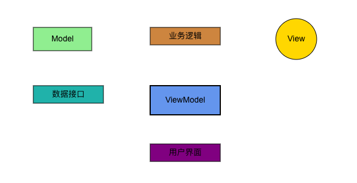

# Dahongpao(大红袍)

> 名称灵感来源于中国的一种红茶：大红袍

「大红袍」是一个使用Typescript写的前端渲染框架，提供了两套不同的底层渲染引擎可供选择，分别是Canvas2d和pixi.js；
「大红袍」提供了常用的业务图形如：Rect(矩形)，Ellipse(椭圆)，Diamond(菱形)，Parallelogram(平行四边形)，Trapezoid(梯形)
，Triangle（三角形）等；
同时，「大红袍」提供了两种方便的调用方式：

1. 可以使用Graphic Model Lanaguage(GML)进行描述，
   GML为笔者定义的一种描述图形语言，更多可见[Graphic Model Language(GML)](https://github.com/jasonnee250/Dahongpao/blob/master/src/grammar/RMGL_Description.md);
2. 可以构造表示节点和连线的数据，直接调用「大红袍」渲染App进行渲染；

## Quick Start
### Install with npm:
```
npm install dahongpao
```
从「大红袍」中引入Canvas2dNormal进行使用；
```typescript
import {Canvas2dNormal, CanvasGMLApp} from "dahongpao";
```
具体案例如下：
```typescript jsx
//直接传入GML语言文本
import {Canvas2dNormal, CanvasGMLApp} from "dahongpao";
import "./index.css"
function App() {

   const gmlApp = new CanvasGMLApp();

   const draw = () => {
      const text="// 定义开始节点\n" +
              "Rect start x 0, y 50, w 100, h 40, text \"开始\", color 0xFF0000;\n" +
              "\n" +
              "// 定义打开登录页面节点\n" +
              "Rect openLoginPage x 150, y 50, w 180, h 40, text \"打开登录页面\", color 0x00FF00;\n" +
              "\n" +
              "// 定义输入用户名节点\n" +
              "Rect inputUsername x 400, y 50, w 180, h 40, text \"输入用户名\", color 0xFF0000;\n" +
              "\n" +
              "// 定义输入密码节点\n" +
              "Rect inputPassword x 400, y 120, w 180, h 40, text \"输入密码\", color 0x990000;\n" +
              "\n" +
              "// 定义点击登录按钮节点\n" +
              "Rect clickLoginButton x 400, y 190, w 180, h 40, text \"点击登录按钮\", color 0xFFA500;\n" +
              "\n" +
              "// 定义验证用户信息节点\n" +
              "Rect verifyInfo x 650, y 50, w 180, h 40, text \"验证用户信息\", color 0x008000;\n" +
              "\n" +
              "// 定义登录成功节点\n" +
              "Rect loginSuccess x 900, y 50, w 180, h 40, text \"登录成功\", color 0x00FF00;\n" +
              "\n" +
              "// 定义登录失败节点\n" +
              "Rect loginFailed x 900, y 120, w 180, h 40, text \"登录失败\", color 0xFF0000;\n" +
              "\n" +
              "// 定义返回重试节点\n" +
              "Rect retry x 650, y 190, w 180, h 40, text \"返回重试\", color 0xFFC300;\n" +
              "\n" +
              "start --> openLoginPage;\n" +
              "openLoginPage --> inputUsername;\n" +
              "openLoginPage -poly-> inputPassword;\n" +
              "openLoginPage -poly-> clickLoginButton;\n" +
              "inputUsername --> verifyInfo;\n" +
              "inputPassword -poly-> verifyInfo;\n" +
              "clickLoginButton -poly-> verifyInfo;\n" +
              "inputUsername -poly-> retry;\n" +
              "inputPassword -poly-> retry;\n" +
              "clickLoginButton -poly-> retry;\n" +
              "verifyInfo --> loginSuccess;\n" +
              "retry -poly-> loginFailed;\n"
      gmlApp.draw(text);
   }


   return (
           <div className="container">
              <button onClick={draw}>Draw</button>
              <div style={{width:'1080px',height:'800px'}}>
                 <Canvas2dNormal gmlApp={gmlApp}/>
              </div>
           </div>
   );

}
export default App
```
生产示例图如下：


「大红袍」也提供了封装好的ExampleApp，包含了简单的交互，如拖动；可以直接导出使用，如下;
```typescript jsx
import {ExampleApp} from "dahongpao";
function App() {
  return (
      <div>
        <ExampleApp/>
      </div>
  )
}
export default App
```
[点击这里进行尝试](https://codesandbox.io/p/live/695b02c2-6294-40fe-9e33-4692248934af)
## 相关说明

GML语言解析由[antlr4](https://github.com/antlr/antlr4)提供支持；
目前支持了canvas2d和pixi.js两种底层渲染引擎，可供用户切换使用；  
使用canvas2d渲染可以使用CanvasGMLApp;pixi.js渲染可以使用PixiGMLApp;  
提供draw方法用于解析GML语言并绘制;

```typescript
export interface GMLApp {
    draw(text: string): void;
}

//使用canvas2d进行渲染
class CanvasGMLApp implements GMLApp {
    draw(text: string): void {
        //...
    }
};

//使用pixi.js进行渲染
class PixiGMLApp implements GMLApp {
    draw(text: string): void {
        //...
    }
};
```

如下所示为使用pixi.js渲染的案例：

```javascript
import {SimpleEditZone} from "@/component/editZone/SimpleEditZone.tsx";
import {PixiCanvas} from "@/pixiRender/PixiCanvas.tsx";
import {PixiGMLApp} from "@/pixiRender/PixiGMLApp.ts";

export const ExampleApp = () => {

    const gmlApp = new PixiGMLApp();

    return (
        <div className="container">
            <SimpleEditZone gmlApp={gmlApp}/>
            <PixiCanvas gmlApp={gmlApp}/>
        </div>);
}
```

下面为使用canvas2d渲染的案例：

```javascript
import {CanvasGMLApp} from "@/canvasRender/CanvasGMLApp.ts";
import {SimpleEditZone} from "@/component/editZone/SimpleEditZone.tsx";
import {Canvas2dNormal} from "@/canvasRender/Canvas2dNormal.tsx";

export const ExampleApp = () => {

    const gmlApp = new CanvasGMLApp();

    return (
        <div className="container">
            <SimpleEditZone gmlApp={gmlApp}/>
            <Canvas2dNormal/>
        </div>
    );
}
```

## 这里举例部分GML的定义及其实际效果

一个简单的描述可以表示如下：

```java
Rect a x 0,y 0,w 100,h 50,angle 0,color 0xCCCCCC,text "hello world",alpha 1,borderWidth 2,borderColor 0x000000,borderAlpha 1;
```

Rect a 代表常见了一个矩形a；  
x 0 代表图形x坐标为0；  
y 0 代表图形y坐标为0；  
w 100代表图形宽度为100；  
h 50代表图形高度为50；   
angle 0代表图形旋转角度为0；   
color 0xCCCCCC代表图形填充颜色为0xCCCCCC；  
text "hello world" 代表图形内部文字为"hello world"；  
alpha 1代表图形填充透明度为1；  
borderWidth代表图形描边宽度为1；  
borderColor代表图形描边颜色为0x000000；  
borderAlpha代表图形描边透明度为1；

### 1.1.2.省略描述

以上图形属性可以省略，属性省略的话会默认属性为缺省值，省略描述如下：

```java
Rect a x 0,y 0,w 100,h 50,color 0xCCCCCC;
```

### 1.1.3.同时描述多个图形

可以对多个图形同时描述，如下：

```java
Rect a,b,c x 0,y 0,w 100,h 50,color 0xCCCCCC;
```

上述描述表示创建了三个矩形，位置坐标都是(0,0),宽度为100，高度为50，颜色为0xCCCCCC;

## 实际效果举例

下面GML语言定义了五个实体：

```text
// 定义ViewModel
Rect ViewModel x 300, y 200, w 120, h 50, text "ViewModel", color 0x6495ED, borderWidth 2;

// 定义View
Circle View x 500, y 100, w 100, h 40, text "View", color 0xFFD700, borderWidth 1;

// 定义Model
Rect Model x 100, y 100, w 100, h 40, text "Model", color 0x90EE90, borderWidth 1;

// 定义数据接口
Rect DataInterface x 100, y 200, w 120, h 30, text "数据接口", color 0x20B2AA, borderWidth 1;

// 定义业务逻辑
Rect BusinessLogic x 300, y 100, w 120, h 30, text "业务逻辑", color 0xCD853F, borderWidth 1;

// 定义用户界面
Rect UserInterface x 300, y 300, w 120, h 30, text "用户界面", color 0x800080, borderWidth 1;
```

渲染出来的效果图：  


## Contributors
* JasonNee(danileo250@163.com)