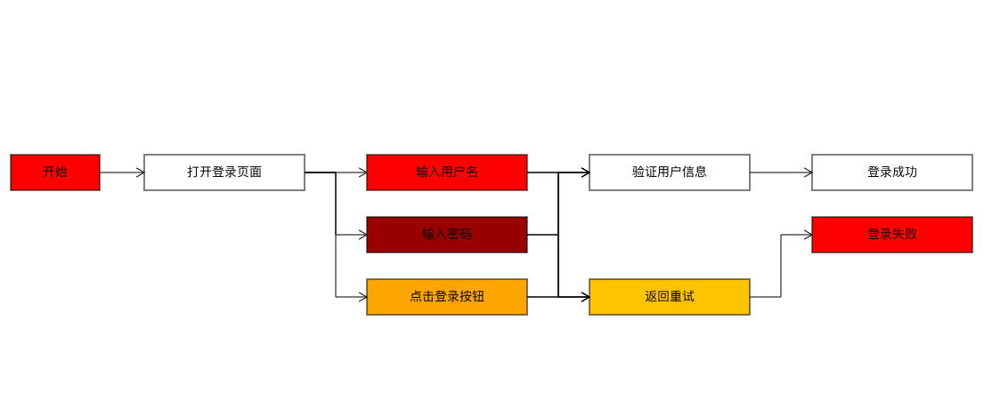

[中文版本点这里](./README.CN.md)
# Dahongpao (大红袍)
> The name is inspired by a type of black tea from China: Dahongpao (Big Red Robe).

Dahongpao is a front-end rendering framework written in TypeScript, offering two different underlying rendering engines to choose from, namely Canvas2d and pixi.js.
Dahongpao provides commonly used business graphics such as: Rect (rectangle), Ellipse (ellipse), Diamond (diamond), Parallelogram (parallelogram), Trapezoid (trapezoid), Triangle (triangle), etc.
Additionally, Dahongpao offers two convenient ways to use it:

1. You can describe using Graphic Model Language (GML), which is a descriptive language for graphics defined by the author, more details can be found at [Graphic Model Language (GML)](https://github.com/jasonnee250/Dahongpao/blob/master/src/grammar/RMGL_Description.md).
2. You can construct data representing nodes and connections, and directly call the Dahongpao rendering App for rendering.

## Quick Start
### Install with npm:
```
npm install dahongpao
```
Use Canvas2dNormal from Dahongpao by importing it:
```typescript
import {Canvas2dNormal, CanvasGMLApp} from "dahongpao";
```
Here is a specific example:
```typescript jsx
// Directly pass GML text
import {Canvas2dNormal, CanvasGMLApp} from "dahongpao";
import "./index.css"
function App() {

   const gmlApp = new CanvasGMLApp();

   const draw = () => {
      const text="// Define start node\n" +
              "Rect start x 0, y 50, w 100, h 40, text \"Start\", color 0xFF0000;\n" +
              "\n" +
              "// Define open login page node\n" +
              "Rect openLoginPage x 150, y 50, w 180, h 40, text \"Open Login Page\", color 0x00FF00;\n" +
              "\n" +
              "// Define input username node\n" +
              "Rect inputUsername x 400, y 50, w 180, h 40, text \"Input Username\", color 0xFF0000;\n" +
              "\n" +
              "// Define input password node\n" +
              "Rect inputPassword x 400, y 120, w 180, h 40, text \"Input Password\", color 0x990000;\n" +
              "\n" +
              "// Define click login button node\n" +
              "Rect clickLoginButton x 400, y 190, w 180, h 40, text \"Click Login Button\", color 0xFFA500;\n" +
              "\n" +
              "// Define verify user information node\n" +
              "Rect verifyInfo x 650, y 50, w 180, h 40, text \"Verify User Information\", color 0x008000;\n" +
              "\n" +
              "// Define login success node\n" +
              "Rect loginSuccess x 900, y 50, w 180, h 40, text \"Login Success\", color 0x00FF00;\n" +
              "\n" +
              "// Define login failed node\n" +
              "Rect loginFailed x 900, y 120, w 180, h 40, text \"Login Failed\", color 0xFF0000;\n" +
              "\n" +
              "// Define retry node\n" +
              "Rect retry x 650, y 190, w 180, h 40, text \"Retry\", color 0xFFC300;\n" +
              "\n" +
              "start --> openLoginPage;\n" +
              "openLoginPage --> inputUsername;\n" +
              "openLoginPage -poly-> inputPassword;\n" +
              "openLoginPage -poly-> clickLoginButton;\n" +
              "inputUsername --> verifyInfo;\n" +
              "inputPassword -poly-> verifyInfo;\n" +
              "clickLoginButton -poly-> verifyInfo;\n" +
              "inputUsername -poly-> retry;\n" +
              "inputPassword -poly-> retry;\n" +
              "clickLoginButton -poly-> retry;\n" +
              "verifyInfo --> loginSuccess;\n" +
              "retry -poly-> loginFailed;\n"
      gmlApp.draw(text);
   }


   return (
           <div className="container">
              <button onClick={draw}>Draw</button>
              <div style={{width:'1080px',height:'800px'}}>
                 <Canvas2dNormal gmlApp={gmlApp}/>
              </div>
           </div>
   );

}
export default App
```
The production example image is as follows:


Dahongpao also provides a packaged ExampleApp, which includes simple interactions such as dragging; it can be used directly for export, as follows:
```typescript jsx
import {ExampleApp} from "dahongpao";
function App() {
  return (
      <div>
        <ExampleApp/>
      </div>
  )
}
export default App
```
[click here to try](https://codesandbox.io/p/live/695b02c2-6294-40fe-9e33-4692248934af)
## Related Explanation

GML language parsing is supported by [antlr4](https://github.com/antlr/antlr4);
Currently, it supports two underlying rendering engines, canvas2d and pixi.js, for users to switch between;
Use CanvasGMLApp for canvas2d rendering; use PixiGMLApp for pixi.js rendering;
The draw method is provided for parsing GML language and drawing;

```typescript
export interface GMLApp {
    draw(text: string): void;
}

// Rendering with canvas2d
class CanvasGMLApp implements GMLApp {
    draw(text: string): void {
        //...
    }
};

// Rendering with pixi.js
class PixiGMLApp implements GMLApp {
    draw(text: string): void {
        //...
    }
};
```

An example of using pixi.js for rendering is as follows:

```javascript
import {SimpleEditZone} from "@/component/editZone/SimpleEditZone.tsx";
import {PixiCanvas} from "@/pixiRender/PixiCanvas.tsx";
import {PixiGMLApp} from "@/pixiRender/PixiGMLApp.ts";

export const ExampleApp = () => {

    const gmlApp = new PixiGMLApp();

    return (
        <div className="container">
            <SimpleEditZone gmlApp={gmlApp}/>
            <PixiCanvas gmlApp={gmlApp}/>
        </div>);
}
```

An example of using canvas2d for rendering is as follows:

```javascript
import {CanvasGMLApp} from "@/canvasRender/CanvasGMLApp.ts";
import {SimpleEditZone} from "@/component/editZone/SimpleEditZone.tsx";
import {Canvas2dNormal} from "@/canvasRender/Canvas2dNormal.tsx";

export const ExampleApp = () => {

    const gmlApp = new CanvasGMLApp();

    return (
        <div className="container">
            <SimpleEditZone gmlApp={gmlApp}/>
            <Canvas2dNormal/>
        </div>
    );
}
```

## Here are some GML definitions and their actual effects

A simple description can be represented as follows:

```java
Rect a x 0,y 0,w 100,h 50,angle 0,color 0xCCCCCC,text "hello world",alpha 1,borderWidth 2,borderColor 0x000000,borderAlpha 1;
```

Rect a represents creating a rectangle a;
x 0 represents the x-coordinate of the shape is 0;
y 0 represents the y-coordinate of the shape is 0;
w 100 represents the width of the shape is 100;
h 50 represents the height of the shape is 50;
angle 0 represents the rotation angle of the shape is 0;
color 0xCCCCCC represents the fill color of the shape is 0xCCCCCC;
text "hello world" represents the text inside the shape is "hello world";
alpha 1 represents the fill opacity of the shape is 1;
borderWidth represents the stroke width of the shape is 1;
borderColor represents the stroke color of the shape is 0x000000;
borderAlpha represents the stroke opacity of the shape is 1;

### 1.1.2. Omitted Description

The above graphic attributes can be omitted. If the attributes are omitted, they will default to their default values. The omitted description is as follows:

```java
Rect a x 0,y 0,w 100,h 50,color 0xCCCCCC;
```

### 1.1.3. Describing Multiple Graphics at Once

Multiple graphics can be described at the same time, as follows:

```java
Rect a,b,c x 0,y 0,w 100,h 50,color 0xCCCCCC;
```

The above description represents the creation of three rectangles, with position coordinates both at (0,0), width 100
