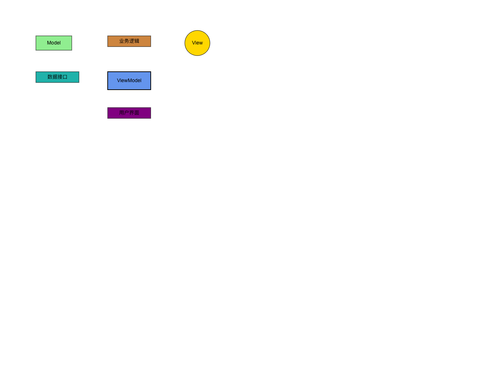

# Dahongpao(大红袍)
>名称灵感来源于中国的一种红茶：大红袍

这个项目主要是提供一种描述图形的语言，根据这种图形描述语言能够方便地转化为图像；  
笔者自定义了一种描述图形语言，并将其称之为[Graphic Model Language(GML)](https://github.com/jasonnee250/Dahongpao/blob/master/src/grammar/RMGL_Description.md);  

## 相关说明
GML语言解析由[antlr4](https://github.com/antlr/antlr4)提供支持；
目前支持了canvas2d和pixi.js两种底层渲染引擎，可供用户切换使用；  
使用canvas2d渲染可以使用CanvasGMLApp;pixi.js渲染可以使用PixiGMLApp;  
提供draw方法用于解析GML语言并绘制;  
```typescript
export interface GMLApp{
    draw(text:string):void;
}
//使用canvas2d进行渲染
class CanvasGMLApp implements GMLApp{
    draw(text:string):void{
        //...
    }
};
//使用pixi.js进行渲染
class PixiGMLApp implements GMLApp{
    draw(text:string):void{
        //...
    }
};
```
如下所示为使用pixi.js渲染的案例：
```javascript
import {SimpleEditZone} from "@/component/editZone/SimpleEditZone.tsx";
import {PixiCanvas} from "@/pixiRender/PixiCanvas.tsx";
import {PixiGMLApp} from "@/pixiRender/PixiGMLApp.ts";

export const ExampleApp=()=>{

    const gmlApp=new PixiGMLApp();

    return (
        <div className="container">
            <SimpleEditZone gmlApp={gmlApp}/>
            <PixiCanvas gmlApp={gmlApp}/>
        </div>);
}
```
下面为使用canvas2d渲染的案例：
```javascript
import {CanvasGMLApp} from "@/canvasRender/CanvasGMLApp.ts";
import {SimpleEditZone} from "@/component/editZone/SimpleEditZone.tsx";
import {Canvas2dNormal} from "@/canvasRender/Canvas2dNormal.tsx";

export const ExampleApp=()=>{

    const gmlApp=new CanvasGMLApp();

    return (
        <div className="container">
            <SimpleEditZone gmlApp={gmlApp}/>
            <Canvas2dNormal/>
        </div>
    );
}
```

## 这里举例部分GML的定义及其实际效果 
一个简单的描述可以表示如下：  
```java
Rect a x 0,y 0,w 100,h 50,angle 0,color 0xCCCCCC,text "hello world",alpha 1,borderWidth 2,borderColor 0x000000,borderAlpha 1;
```
Rect a 代表常见了一个矩形a；  
x 0 代表图形x坐标为0；  
y 0 代表图形y坐标为0；  
w 100代表图形宽度为100；  
h 50代表图形高度为50；   
angle 0代表图形旋转角度为0；   
color 0xCCCCCC代表图形填充颜色为0xCCCCCC；  
text "hello world" 代表图形内部文字为"hello world"；  
alpha 1代表图形填充透明度为1；  
borderWidth代表图形描边宽度为1；  
borderColor代表图形描边颜色为0x000000；  
borderAlpha代表图形描边透明度为1；
### 1.1.2.省略描述
以上图形属性可以省略，属性省略的话会默认属性为缺省值，省略描述如下：
```java
Rect a x 0,y 0,w 100,h 50,color 0xCCCCCC;
```
### 1.1.3.同时描述多个图形
可以对多个图形同时描述，如下：
```java
Rect a,b,c x 0,y 0,w 100,h 50,color 0xCCCCCC;
```
上述描述表示创建了三个矩形，位置坐标都是(0,0),宽度为100，高度为50，颜色为0xCCCCCC;
## 实际效果举例
下面GML语言定义了五个实体：  
```text
// 定义ViewModel
Rect ViewModel x 300, y 200, w 120, h 50, text "ViewModel", color 0x6495ED, borderWidth 2;

// 定义View
Circle View x 500, y 100, w 100, h 40, text "View", color 0xFFD700, borderWidth 1;

// 定义Model
Rect Model x 100, y 100, w 100, h 40, text "Model", color 0x90EE90, borderWidth 1;

// 定义数据接口
Rect DataInterface x 100, y 200, w 120, h 30, text "数据接口", color 0x20B2AA, borderWidth 1;

// 定义业务逻辑
Rect BusinessLogic x 300, y 100, w 120, h 30, text "业务逻辑", color 0xCD853F, borderWidth 1;

// 定义用户界面
Rect UserInterface x 300, y 300, w 120, h 30, text "用户界面", color 0x800080, borderWidth 1;
```
渲染出来的效果图：  



